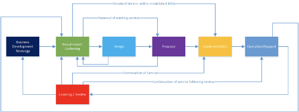

# What is research engagement?

Research engagement is the process of talking to user communities from the global academic, education and scientific community. The researchers, the students, the lecturers, the big data users, the organisations performing research, the institutes providing research data, universities, projects and many others. The roe of research engagement exists to understand what the needs and requirements of the users of the national research and education networks are, across Europe and the world. There are many names for this role; user engagement, research engagement, academic engagement, academic liaison, science engagement, user relations, etc. They all broadly cover the same actions. But the approach is often directed towards a particular group that is important to the organisation. Often that approach is so important, someone is hired to fulfil this role or there is a department dedicated to this function.

There are overall three main aspects to the role \(however you want to describe it\):

* Academic and user liaison
* Innovation specialist
* Commercialisation officer

However, this is not a consistent view across all of the research engagement community. Instead, Research Engagement takes on at least one of these aspects depending on the organisation involved. Collectively though, across the world, all three aspects are represented.

Research engagement can go much further than just an academic liaison role, and instead act as a strategic role at an NREN, e-infrastructure or other institution.

The research engagement role acts as a thread which establishes and binds the relationships between the organisation they work for and the users of that organisation's services. In some circumstances, The role also oversees the progression of a service, from the requirements gathering, design, procurement, implementation and then into operation and support.

Below is a high-level overview of the GÉANT engagement life cycle which the research engagement and support team has responsibility for. As can be seen, the process itself is not clear or simple.

Out of scope:

* Monetization of services \(specifically turning EU funded services into things that can be sold\) – This will be picked up as a topic in the future and not cover it in this document.

As you can probably tell, this is not a simple role and there is a lot of disagreement about the scope of the role depending on who you talk to.

Fundamentally, where we do agree, is that the role exists to support science and to help advance global knowledge through the establishment of services to make researchers' lives easier.

